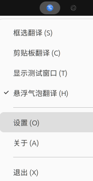
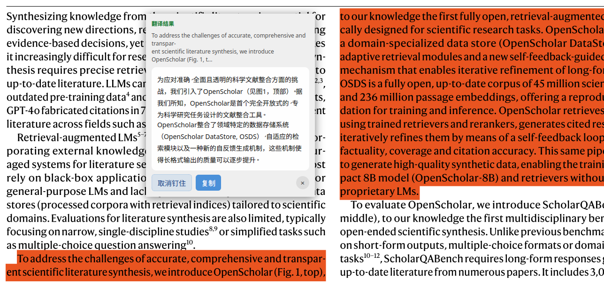
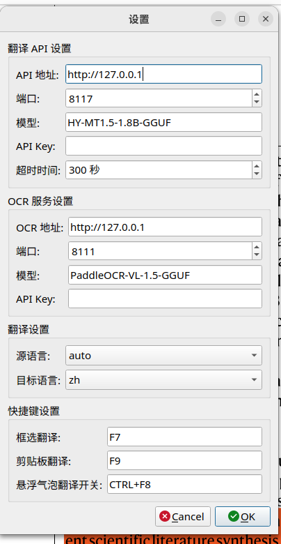
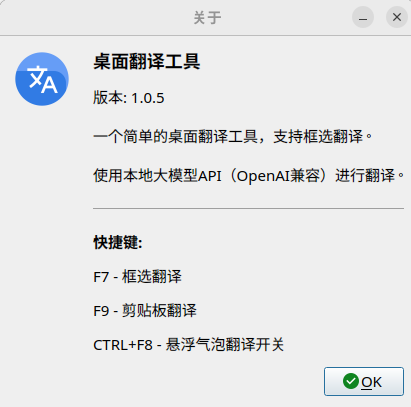

# Desktop Translate  

#### [English](README.md) |  [中文](README_ZH.md)

A simple desktop translation tool that supports region selection translation, clipboard translation, and floating bubble translation. Uses local large model API (OpenAI compatible) for translation.

## Features

- **Region Selection Translation**: Select any region on screen, automatically OCR-recognize and translate text
- **Clipboard Translation**: Automatically translate text in the clipboard
- **Floating Bubble Translation**: Floating window that translates PRIMARY selection / clipboard text in real time
- **Local Models**: Based on llama.cpp, supports OpenAI compatible API, data stays local
- **Global Shortcuts**: Trigger translation with global shortcuts, no need to switch windows
- **Translation Result Bubble**: Elegant floating bubble to display translation results, supports pinning and copying

## Screenshots

### System Tray Menu



### Translation Result Bubble



### Settings Panel



### About



## Dependencies

### Linux (Ubuntu/Debian)

```bash
sudo apt install cmake qt6-base-dev libcurl4-openssl-dev libx11-dev pkg-config
# Optional: for region selection text capture
sudo apt install xdotool xsel
```

### Windows

- Visual Studio 2022 (MSVC)
- CMake 3.20+
- Qt6 (installed via vcpkg)
- libcurl (installed via vcpkg)

## Build

### Linux

```bash
# Default build (CUDA enabled)
./build.sh

# Build without CUDA
DESKTOP_TRANSLATE_ENABLE_LLAMA_CUDA=OFF ./build.sh

# Debug build
./build_debug.sh
```

Build artifacts:
- `build/desktop_translate` — main program
- `build/bin/llama-server` — llama.cpp inference server

### Windows

```powershell
mkdir build
cd build
cmake .. -DCMAKE_BUILD_TYPE=Release
cmake --build . --config Release
```

### Package as deb (Linux)

```bash
./build_deb.sh
# or specify version
./build_deb.sh 1.0.7
```

Generated deb package is located in the `dist/` directory.

## Usage

### Launch

```bash
./build/desktop_translate
```

After launch, the program runs in the system tray.

### Shortcuts

| Shortcut | Action |
|----------|--------|
| `F7` | Region selection translation |
| `F9` | Clipboard translation |
| `Ctrl+F8` | Toggle floating bubble translation |

Shortcuts can be customized in the settings panel.

### Tray Menu

- **Region Selection Translation (S)**: Enter selection mode, use mouse to select text area to translate
- **Clipboard Translation (C)**: Translate text currently in the clipboard
- **Show Test Window (T)**: Open debug test window
- **Floating Bubble Translation (H)**: Toggle floating translation bubble
- **Settings (O)**: Open settings panel
- **About (A)**: Show version information
- **Exit (X)**: Exit the program

### Translation Result Bubble

After translation completes, results are displayed as a bubble near the selection area:
- **Pin**: Fix the bubble to prevent auto-close
- **Copy**: Copy the translation to clipboard
- **Drag**: Drag the bubble to any position
- Unpinned bubbles auto-close after 12 seconds

## Configuration

### Translation API Settings

| Setting | Description | Example |
|---------|-------------|---------|
| API Address | Local model service address | `http://127.0.0.1` |
| Port | Service port | `8117` |
| Model | Model name | `HY-MT1.5-1.8B-GGUF` |
| API Key | Authentication key (optional) | |
| Timeout | Request timeout (seconds) | `300` |

### OCR Service Settings

| Setting | Description | Example |
|---------|-------------|---------|
| OCR Address | OCR service address | `http://127.0.0.1` |
| Port | OCR service port | `8111` |
| Model | OCR model name | `PaddleOCR-VL-1.5-GGUF` |
| API Key | Authentication key (optional) | |

### Translation Settings

| Setting | Description | Values |
|---------|-------------|--------|
| Source Language | Original text language | `auto` (auto-detect), `en`, `zh`, `ja`, etc. |
| Target Language | Translation language | `zh`, `en`, `ja`, `ko`, etc. |

## Local Model Deployment

This project uses llama.cpp as the inference backend, supporting GGUF format models.

### Translation Model

It is recommended to use a translation model that supports the OpenAI compatible API, for example:

```bash
# Start translation model service with llama-server
./build/bin/llama-server \
  --model models/HY-MT1.5-1.8B-GGUF \
  --port 8117 \
  --host 127.0.0.1 \
  --ctx-size 4096
```

### OCR Model

Region selection translation requires OCR service support:

```bash
# Start OCR model service with llama-server
./build/bin/llama-server \
  --model models/PaddleOCR-VL-1.5-GGUF \
  --port 8111 \
  --host 127.0.0.1 \
  --ctx-size 4096
```

## Project Structure

```
desktop_translate/
├── src/                    # Source code
│   ├── main.cpp            # Entry point
│   ├── MainWindow.cpp      # Main window / tray
│   ├── HoverTranslateWindow.cpp  # Floating translation window
│   ├── SelectionOverlay.cpp      # Region selection overlay
│   ├── TranslationService.cpp    # Translation service
│   ├── TranslationResultWindow.cpp # Translation result bubble
│   ├── OCRService.cpp      # OCR service
│   ├── Config.cpp          # Configuration management
│   ├── ClipboardManager.cpp # Clipboard management
│   ├── GlobalShortcut.cpp  # Global shortcuts
│   ├── TestWindow.cpp      # Test window
│   └── ModelServiceManager.cpp # Model service management
├── include/                # Header files
├── third_party/            # Third-party libraries
│   ├── json/               # nlohmann/json
│   └── llama.cpp/          # llama.cpp
├── Icons8/                 # Icon resources
├── assets/                 # Screenshot resources
├── CMakeLists.txt          # CMake configuration
├── build.sh                # Linux build script
├── build_debug.sh          # Debug build script
└── build_deb.sh            # deb packaging script
```

## License

MIT
